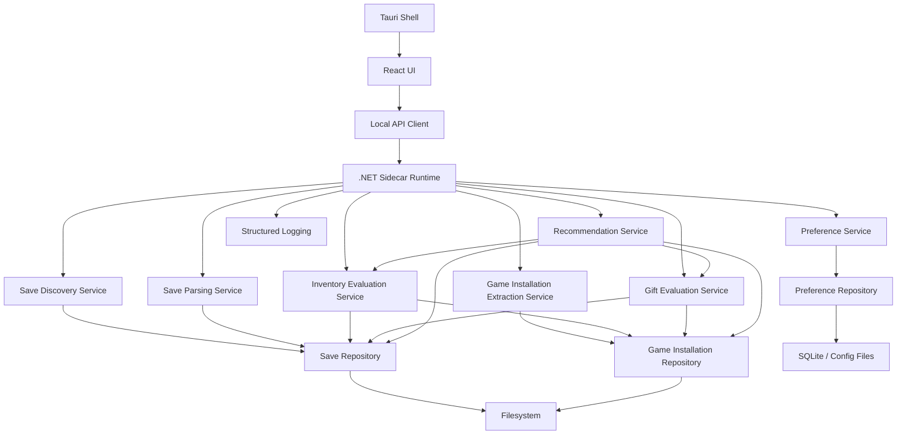
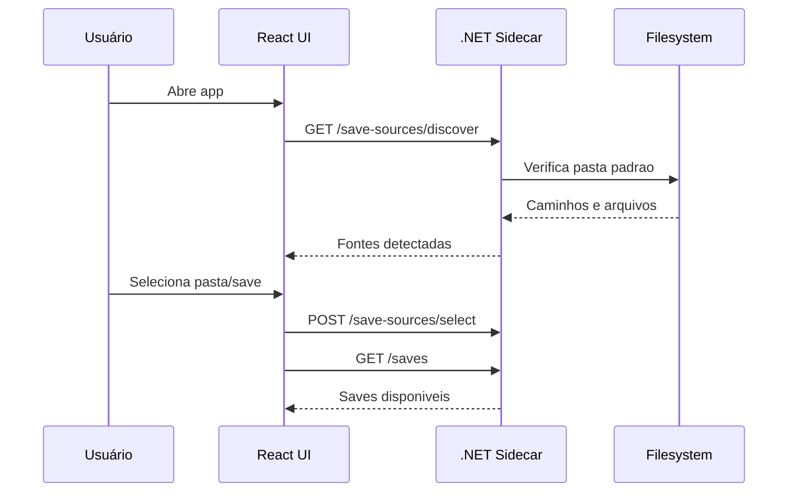
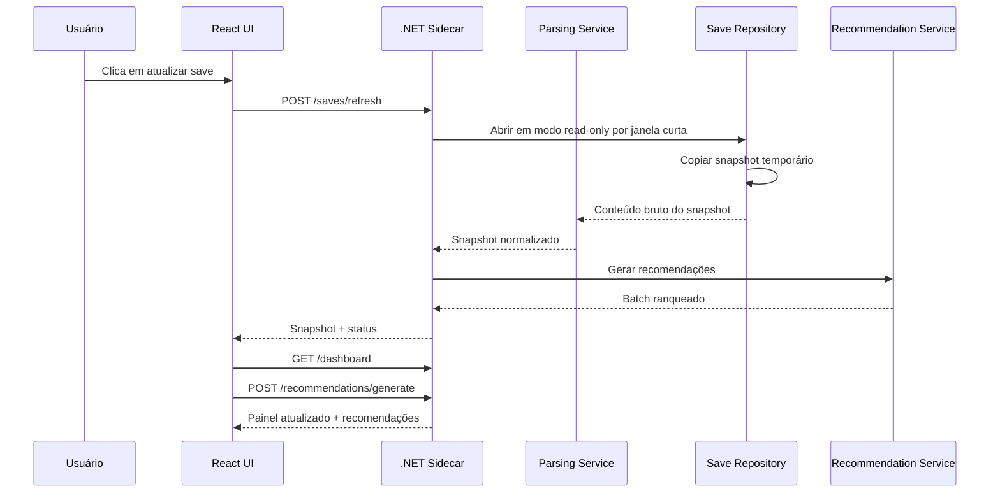
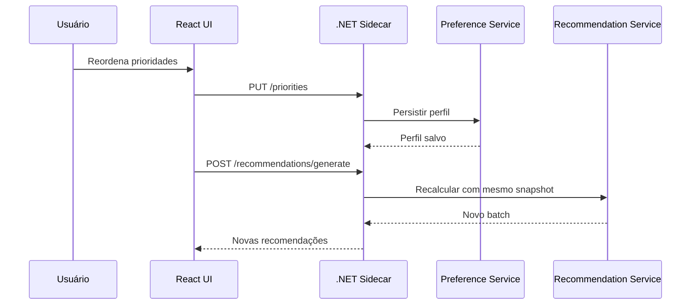
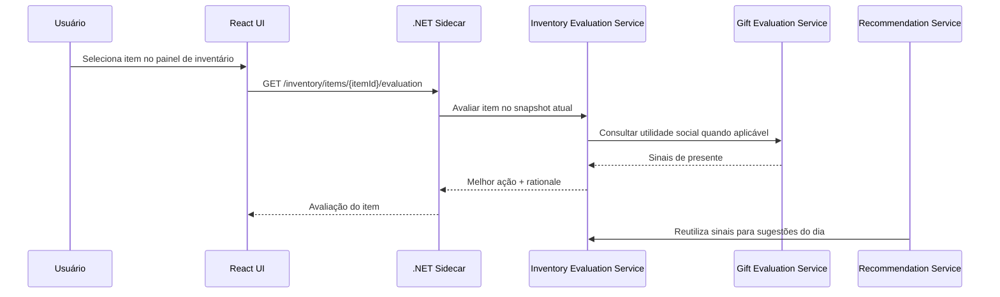

# FOM Oracle — Arquitetura Técnica

## 1. Avaliação de Harnessability

| Dimensão | Pergunta | Resposta |
|---|---|---|
| Tipagem | A linguagem permite type-checking estático? | Sim. C# e TypeScript strict oferecem tipagem forte e sensores computacionais naturais. |
| Módulos | É possível definir limites de módulo verificáveis? | Sim. A solução pode impor camadas no core via NetArchTest e no frontend via ESLint boundaries/import rules. |
| Framework | O framework abstrai detalhes que o agente não precisa gerenciar? | Parcialmente. Tauri reduz peso do shell; ASP.NET Core Minimal API reduz boilerplate no sidecar. |
| Testabilidade | A arquitetura é naturalmente testável (DI, interfaces)? | Sim. Core sidecar em .NET com DI explícita e regras isoláveis por serviço. |
| Observabilidade | Logs estruturados são naturais nesta stack? | Sim. Logging estruturado em .NET e telemetria local simples no frontend. |

### Leitura
Harnessability é alta se o projeto mantiver o núcleo de negócio no sidecar C# e tratar a UI React como cliente fino. O principal risco de harnessability está em deixar regras de recomendação vazarem para a UI.

## 2. Stack Recomendada

Ver [stack.md](./stack.md).

## 3. Padrão de Camadas

Ordem obrigatória:

```text
Types → Config → Repository → Service → Runtime → UI
```

### Types
- Responsabilidade: entidades, value objects, enums, DTOs internos, contratos de domínio.
- Pode importar: bibliotecas base da linguagem.
- Não pode importar: Config, Repository, Service, Runtime, UI.

### Config
- Responsabilidade: configuração, binding de opções, feature flags locais, paths padrão.
- Pode importar: Types.
- Não pode importar: Repository, Service, Runtime, UI.

### Repository
- Responsabilidade: acesso a filesystem, SQLite, snapshots, logs de persistência, extração de arquivos locais do jogo.
- Pode importar: Types, Config.
- Não pode importar: Service, Runtime, UI.
- Deve ler saves em modo estritamente read-only, com o menor tempo possível de abertura de arquivo.
- Não deve manter handles do save abertos além do necessário para copiar ou materializar um snapshot local.

### Service
- Responsabilidade: casos de uso, parser, reconciliação de fontes, motor de recomendação, compatibilidade de versão.
- Pode importar: Types, Config, Repository.
- Não pode importar: Runtime, UI.

### Runtime
- Responsabilidade: composição do sidecar, DI, HTTP local, ciclo de vida do processo, observabilidade, health checks.
- Pode importar: Types, Config, Repository, Service.
- Não pode importar: UI.
- Deve tratar o jogo como processo coexistente: leituras de save precisam degradar com retry/backoff curto quando o arquivo estiver temporariamente indisponível.
- Deve preservar o último snapshot válido quando uma leitura falhar por conflito de acesso ou arquivo ocupado.

### UI
- Responsabilidade: telas, fluxos, estado de interação, renderização de dados, comandos do usuário.
- Pode importar: contratos públicos do Runtime via cliente HTTP/SDK gerado e tipos de transporte compartilhados.
- Não pode importar: repositórios, regras de domínio, parser ou motores internos.

### Regras mecânicas
- `NetArchTest`: bloqueia dependências inválidas no core.
- `ESLint import/boundaries`: bloqueia imports cruzados indevidos no frontend.
- Regra de remediação: “mova a regra de negócio para Service” ou “mova o acesso a IO para Repository”.

## 4. Diagrama de Componentes



## 5. Modelo de Dados

Ver [domain.md](./domain.md).

## 6. Contratos de API

Todos os contratos abaixo são `local-only` via loopback HTTP. Não há autenticação na v1 porque o processo é local e single-user.

### GET /api/v1/health
Auth: none

Response 200:
```json
{
  "status": "ok",
  "appVersion": "string",
  "coreVersion": "string"
}
```

### GET /api/v1/save-sources/discover
Auth: none

Response 200:
```json
{
  "defaultPath": "string|null",
  "sources": [
    {
      "id": "string",
      "rootPath": "string",
      "detectionMode": "auto|manual",
      "status": "ready|missing|invalid"
    }
  ]
}
```

### POST /api/v1/save-sources/select
Request:
```json
{
  "rootPath": "string"
}
```

Response 200:
```json
{
  "sourceId": "string",
  "status": "ready|invalid|empty"
}
```

### GET /api/v1/saves?sourceId={id}
Response 200:
```json
{
  "sourceId": "string",
  "saves": [
    {
      "id": "string",
      "displayName": "string",
      "filePath": "string",
      "lastModifiedAt": "string",
      "compatibilityStatus": "supported|partial|unsupported"
    }
  ]
}
```

### POST /api/v1/saves/select
Request:
```json
{
  "saveId": "string"
}
```

Response 200:
```json
{
  "selectedSaveId": "string"
}
```

### POST /api/v1/saves/refresh
Request:
```json
{
  "saveId": "string"
}
```

Response 200:
```json
{
  "snapshotId": "string",
  "parseStatus": "success|partial|failed",
  "warnings": ["string"]
}
```

### GET /api/v1/dashboard?saveId={id}
Response 200:
```json
{
  "snapshotId": "string",
  "summary": {
    "dayNumber": 0,
    "season": "string",
    "goldAmount": 0,
    "townRank": "string",
    "mineLevel": 0
  },
  "domains": {
    "inventory": {},
    "skills": {},
    "relationships": {},
    "animals": {},
    "quests": {}
  }
}
```

### GET /api/v1/priorities
Response 200:
```json
{
  "available": [
    { "code": "main-quests", "label": "Main Quests" }
  ],
  "selected": [
    { "code": "main-quests", "rankOrder": 1 }
  ]
}
```

### PUT /api/v1/priorities
Request:
```json
{
  "selected": [
    { "code": "main-quests", "rankOrder": 1 },
    { "code": "money", "rankOrder": 2 }
  ]
}
```

Response 200:
```json
{
  "profileId": "string",
  "selected": [
    { "code": "main-quests", "rankOrder": 1 },
    { "code": "money", "rankOrder": 2 }
  ]
}
```

### POST /api/v1/recommendations/generate
Request:
```json
{
  "saveId": "string",
  "profileId": "string",
  "prioritizedQuestIds": ["string"]
}
```

Response 200:
```json
{
  "batchId": "string",
  "items": [
    {
      "rankOrder": 1,
      "category": "social",
      "title": "string",
      "summary": "string",
      "rationale": "string"
    }
  ]
}
```

### GET /api/v1/inventory?saveId={id}
Response 200:
```json
{
  "snapshotId": "string",
  "items": [
    {
      "itemId": "string",
      "displayName": "string",
      "quantity": 0,
      "locations": [
        { "type": "backpack|chest|barnChest", "label": "string", "quantity": 0 }
      ],
      "type": "string"
    }
  ],
  "filters": {
    "types": ["string"]
  }
}
```

### GET /api/v1/inventory/items/{itemId}/evaluation?saveId={id}
Response 200:
```json
{
  "itemId": "string",
  "bestAction": "sell|keep|donate|gift|feed|craft|store",
  "rationale": "string",
  "signals": [
    {
      "kind": "quest|recipe|museum|gift|animal|economy",
      "summary": "string"
    }
  ]
}
```

### GET /api/v1/npcs/{npcId}/gift-evaluation?saveId={id}
Response 200:
```json
{
  "npcId": "string",
  "recommendations": [
    {
      "itemId": "string",
      "appreciation": "liked|loved",
      "availability": "owned|craftable|buyable|unknown",
      "rationale": "string"
    }
  ]
}
```

### GET /api/v1/preferences
Response 200:
```json
{
  "selectedSaveId": "string|null",
  "selectedSaveSourceId": "string|null",
  "lastPriorityProfileId": "string|null"
}
```

## 7. Fluxos Críticos

### Fluxo 1 — Descobrir pasta e selecionar save



### Fluxo 2 — Atualizar save e regenerar painel/recomendações



### Fluxo 3 — Reordenar prioridades



### Fluxo 4 — Avaliar item e reutilizar o racional nas recomendações



## 8. Decisões de Arquitetura (ADRs)

### ADR-01
Decisão: usar `Tauri + React + TypeScript` para a UI desktop.
Contexto: o produto precisa de um painel rico, iterável e com alta densidade visual.
Alternativas: WPF/WinUI; Electron + React.
Consequências: melhor velocidade de evolução da UX; maior necessidade de integração explícita com o core.
RF/RNF atendido: RF-04, RF-05, RF-06, RNF-08, RNF-12.

### ADR-02
Decisão: usar `sidecar .NET/C#` separado para parser, extração e motor de recomendação.
Contexto: o risco principal está em leitura local robusta, modelagem de domínio e heurísticas confiáveis.
Alternativas: domínio no frontend; tudo em Rust; tudo em Node.
Consequências: arquitetura mais modular e testável; build e IPC mais sofisticados.
RF/RNF atendido: RF-03, RF-08, RF-11, RF-12, RNF-02, RNF-03, RNF-14, RNF-15.

### ADR-03
Decisão: usar `HTTP local loopback` como contrato entre UI e core.
Contexto: precisamos de fronteira clara entre processos, fácil debug e contratos testáveis.
Alternativas: Tauri commands diretos; stdio IPC; gRPC.
Consequências: mais overhead que chamada in-process, mas maior observabilidade e desacoplamento.
RF/RNF atendido: RF-03, RF-04, RF-06, RNF-06, RNF-09, RNF-13.

### ADR-04
Decisão: persistir preferências em SQLite e configuração local em arquivo.
Contexto: v1 precisa restaurar contexto entre sessões sem infraestrutura online.
Alternativas: apenas JSON; apenas SQLite.
Consequências: solução híbrida simples e resiliente; leve complexidade extra de persistência.
RF/RNF atendido: RF-13, RNF-01, RNF-07, RNF-09.

### ADR-05
Decisão: priorizar dados do save e da instalação local do jogo sobre wiki.
Contexto: o PRD exige fonte primária local sempre que viável.
Alternativas: usar wiki como fonte principal; abordagem totalmente híbrida sem hierarquia.
Consequências: maior esforço inicial em engenharia reversa; melhor aderência à versão instalada do usuário.
RF/RNF atendido: RF-11, RNF-10, RNF-11, RNF-15.

### ADR-06
Decisão: manter o motor de decisão da v1 heurístico, determinístico e explicável, sem machine learning.
Contexto: recomendações, avaliações de itens e presentes precisam explicar fatores concretos do save e do catálogo.
Alternativas: ML supervisionado para ranking; modelo híbrido com ranking probabilístico.
Consequências: maior previsibilidade e testabilidade na v1; futura calibração por ML permanece possível se houver dados reais e preservação de rationale humano.
RF/RNF atendido: RF-06, RF-07, RF-14, RF-15, RF-16, RNF-05, RNF-14.

## 9. Riscos Técnicos

| Risco | Severidade | Mitigação |
|---|---|---|
| Formato do save mudar em patches do jogo | Alto | Versionar parser, snapshots e compatibilidade; testes com fixtures reais |
| Extração da instalação local revelar menos dados do que o esperado | Alto | Desenhar catálogo com hierarquia de fontes e fallback explícito |
| UI começar a carregar regras de recomendação | Médio | Enforce de camada; cliente HTTP tipado; revisão estrutural |
| Avaliação de itens e presentes exigir catálogo incompleto | Alto | Entregar sinais parciais com source trace e degradar recomendações sem bloquear o restante |
| IPC entre Tauri e sidecar aumentar complexidade de build | Médio | Scripts de desenvolvimento únicos e contratos estáveis por versão |
| Incompatibilidade com saves modificados por mods | Médio | Sinalizar status partial/unsupported e degradar com elegância |
| Persistência local corrompida | Baixo | Migrações simples, backup leve e rebuild de estado derivável |
| Leitura do save travar o jogo ou falhar durante uso simultâneo | Alto | Abrir arquivo read-only, manter handles curtos, usar snapshot temporário e retry/backoff com preservação do último estado válido |

## 10. Pipeline de CI/CD

### Workflows

| Workflow | Gatilho | Ações |
|---|---|---|
| `ci.yml` | PR para `main`/`develop`; push para `develop` | Gate objetivo de aderência ao `DESIGN.md` para frontend/UI, setup Node/pnpm/.NET, check-env, testes Pester, frontend lint/build, `pnpm audit` |
| `pr-release-gate.yml` | PR para `main` | Valida closing keywords para issues e exatamente uma label `release:patch`, `release:minor` ou `release:major` no PR |
| `auto-release.yml` | PR mergeado em `main` | Sincroniza label de impacto nas issues fechadas, calcula próxima versão SemVer e publica GitHub Release |
| `gc.yml` | Semanal (domingo 06:00 UTC) | Varre TODO/FIXME/HACK no código, abre issue de limpeza |
| Futuro: deploy | PR → main | Deploy automático em staging + aprovação manual para produção (após T-03) |

### Runner

`ubuntu-latest` + `pwsh` (PowerShell Core) para scripts de teste cross-platform.

### Sensores por Camada

| Camada | Onde | O que roda |
|---|---|---|
| 1 — Pré-commit | local (dev) | Fluxo de protótipo quando aplicável + lint + type-check + testes unitários (quando T-04 existir) |
| 2 — CI por PR | `ci.yml` | Gate de aderência objetiva ao `DESIGN.md` + setup + T-01 smoke + testes de governança + lint/build placeholder + security audit |
| 3 — Release pós-merge | `auto-release.yml` (PR mergeado em main) | Versionamento automático e GitHub Release |
| 4 — Agendado | `gc.yml` (semanal) | Scan TODO/FIXME, abre issue de limpeza |

### Gates futuros (após T-03/T-04)

- `dotnet build` e `dotnet test` com cobertura
- ESLint com regras de boundaries
- NetArchTest estrutural
- Testes de contrato da Local API
- Mutation testing (semanal)
- Docker multi-stage build

## 11. Configuração de Sensores Computacionais

### Feedforward
- [ ] Linter com regras de camada e mensagens de remediação inline no frontend
- [ ] TypeScript strict mode
- [ ] .NET nullable + warnings as errors nas camadas centrais
- [ ] NetArchTest para bloqueio de dependências inválidas
- [x] AGENTS.md apontando para `.catalog/`
- [x] CI pipeline com gates de validação
- [x] Gate de aderência objetiva ao `DESIGN.md` para mudanças de frontend/UI
- [x] GC semanal automatizado

### Feedback
- [ ] Testes unitários para parser, extratores e recommendation service
- [ ] Testes de contrato da Local API
- [ ] Testes estruturais de camadas no core
- [ ] Testes de componentes críticos da UI
- [ ] Security scan de dependências em CI
- [ ] Mutation testing do motor de recomendação em pipeline semanal

## 12. Rastreabilidade RF → Componentes

| RF | Componentes principais |
|---|---|
| RF-01, RF-02 | Save Discovery Service, Save Repository, React onboarding flow |
| RF-03 | Refresh endpoint, Save Parsing Service, Snapshot persistence |
| RF-04 | Dashboard endpoint, Summary projection, React dashboard modules |
| RF-05 | Priority Service, Preference Service, UI reorder controls |
| RF-06, RF-07, RF-08, RF-09, RF-10 | Recommendation Service, Knowledge Catalog, Recommendation projections |
| RF-11 | Game Installation Extraction Service, Knowledge Source model, fallback policy |
| RF-12 | Compatibility Service, error mapping, diagnostic logging |
| RF-13 | Preference Repository, startup restore flow |
| RF-14 | Inventory Evaluation Service, Dashboard projections, Knowledge Catalog |
| RF-15 | Gift Evaluation Service, Relationship projections, Knowledge Catalog |
| RF-16 | Recommendation Service, Inventory Evaluation Service, Gift Evaluation Service, Priority Service |
