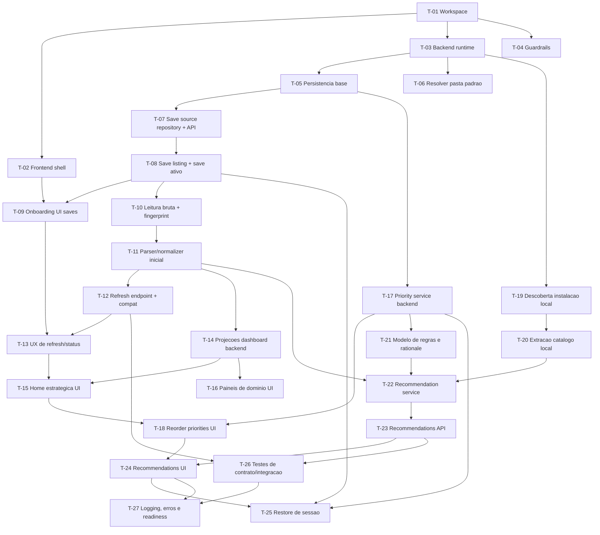

# Milestone: v1-oraculo-local-first

Status: in-progress
Criado: 2026-05-09
Branch: `feature/v1-oraculo-local-first` -> `main`
PRD: `PRD-fom-oracle.md`
Tech Solution: `.catalog/architecture.md`

Todas as tasks abaixo foram fatiadas com meta de revisão humana de ate `300 LOC` por task, com limite tolerável de `500 LOC`. Se uma implementação extrapolar isso, a task deve ser quebrada antes de codar.

Excecao registrada para `T-01`: como o repositorio git foi inicializado somente depois das etapas de PRD, arquitetura e breakdown, esta primeira PR tambem precisou persistir os artefatos-base ja aprovados (`PRD`, `.catalog/`, `.milestones/` e governanca) junto com o scaffold inicial. Essa excecao vale apenas para a T-01; as proximas tasks devem voltar ao limite normal de revisabilidade.

## User Stories

- [ ] US-01: Fundacao do workspace e shell local (T-01, T-02, T-03, T-04, T-05)
- [ ] US-02: Descoberta de saves e selecao do save ativo (T-06, T-07, T-08, T-09)
- [ ] US-03: Atualizacao de save e snapshots normalizados (T-10, T-11, T-12, T-13)
- [ ] US-04: Painel consolidado e home estrategica (T-14, T-15, T-16)
- [ ] US-05: Prioridades dinamicas com persistencia local (T-17, T-18)
- [ ] US-06: Catalogo local do jogo e hierarquia de fontes (T-19, T-20)
- [ ] US-07: Recomendacoes estrategicas explicaveis (T-21, T-22, T-23, T-24)
- [ ] US-08: Restauracao de sessao, resiliencia e verificacao integrada (T-25, T-26, T-27)

## Mapa de Dependencias

## Roadmap de Execucao

### Sprint 1 — Fundacao
Sequencial: T-01 -> T-02 -> T-03 -> T-04 -> T-05

### Sprint 2 — Saves e snapshots
Paralelo: T-06 || T-07
Depois: T-08 -> T-09 -> T-10 -> T-11 -> T-12 -> T-13

### Sprint 3 — Painel e prioridades
Paralelo: T-14 || T-17 || T-19
Depois: T-15 || T-16 || T-18 || T-20

### Sprint 4 — Recomendacoes
Sequencial: T-21 -> T-22 -> T-23 -> T-24

### Sprint 5 — Integracao e endurecimento
Paralelo: T-25 || T-26
Depois: T-27

## Regra de branch derivada do mapa

Cada task deve usar branch `feature/T-XX-descricao`.

| Situacao | Base da branch | PR aponta para |
|---|---|---|
| T-XX sem dependencia | `develop` | `develop` |
| T-XX com `Depends: T-YY` | `feature/T-YY-descricao` | `feature/T-YY-descricao` |
| T-YY mesclada em develop | `develop` (rebase) | `develop` |

## User Stories resumidas

### ID: US-01
Requisito PRD: RF-01, RF-03, RF-13

Como jogador, quero abrir um app desktop local funcional, para que eu possa carregar saves e operar a ferramenta sem friccao inicial.

CA-01: frontend, shell desktop e sidecar local sobem em ambiente de desenvolvimento com healthcheck funcional.
CA-02: guardrails de camada e tipagem estrita impedem violacoes basicas antes de features.

Estimativa: M
Dependencias: nenhuma

### ID: US-02
Requisito PRD: RF-01, RF-02

Como jogador, quero que o app descubra meus saves e me permita selecionar um save ativo, para que eu use o planejamento em cima do arquivo correto.

CA-01: o app detecta a pasta padrao quando disponivel e aceita pasta manual como fallback.
CA-02: o usuario consegue listar saves e marcar um save ativo.

Estimativa: M
Dependencias: US-01

### ID: US-03
Requisito PRD: RF-03, RF-12

Como jogador, quero atualizar o save e ter um snapshot normalizado com status de compatibilidade, para que o painel e as sugestoes reflitam meu progresso recente.

CA-01: o refresh relê o save ativo e persiste um snapshot com fingerprint.
CA-02: o sistema diferencia sucesso, parcial e falha de parsing.

Estimativa: G
Dependencias: US-02

### ID: US-04
Requisito PRD: RF-04

Como jogador, quero ver um painel consolidado e um resumo no topo da home estrategica, para que eu entenda rapidamente meu contexto atual.

CA-01: o backend projeta summary + dominios principais a partir do snapshot.
CA-02: a UI exibe resumo e paineis com estados de carregamento e parcialidade.

Estimativa: M
Dependencias: US-03

### ID: US-05
Requisito PRD: RF-05, RF-13

Como jogador, quero selecionar e reordenar prioridades com persistencia local, para que o app respeite meu foco atual entre sessoes.

CA-01: o backend persiste o perfil atual de prioridades.
CA-02: a UI permite ordenar e reusar a configuracao sem trocar de save.

Estimativa: M
Dependencias: US-01, US-04

### ID: US-06
Requisito PRD: RF-11

Como sistema, quero extrair dados da instalacao local do jogo e registrar a hierarquia de fontes, para que a recomendacao use fontes primarias locais sempre que possivel.

CA-01: o app descobre a instalacao local e extrai metadados/versionamento basico.
CA-02: o catalogo local fica separado de fontes externas e com rastreabilidade de origem.

Estimativa: G
Dependencias: US-01

### ID: US-07
Requisito PRD: RF-06, RF-07, RF-08, RF-09, RF-10

Como jogador, quero receber recomendacoes estrategicas explicaveis baseadas no save e nas prioridades, para que eu saiba o que fazer naquele dia.

CA-01: o backend gera uma lista ordenada de recomendacoes com categoria e justificativa humana.
CA-02: a UI exibe as recomendacoes atualizadas quando o save ou as prioridades mudam.

Estimativa: G
Dependencias: US-03, US-05, US-06

### ID: US-08
Requisito PRD: RF-12, RF-13

Como jogador, quero que o app restaure meu contexto, trate erros com clareza e tenha verificacao integrada dos fluxos criticos, para que eu confie no uso recorrente.

CA-01: o app reabre restaurando save e prioridades quando validos.
CA-02: existem testes de contrato/integracao para os fluxos criticos de descoberta, refresh e recomendacao.

Estimativa: M
Dependencias: US-02, US-03, US-05, US-07
